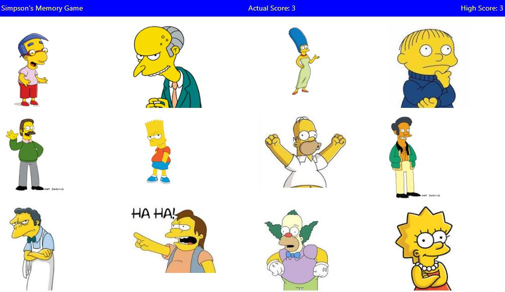

# Simpson's Memory Game

## Overview 

Memory game developed in React.js. You will need to click on every image without selecting the same twice and trying to choose the 12 characters.

  

## Technologies used to develop the app
- React.js
- CSS
- JSON

## App Link
https://jfsilvah.github.io/clicky-game/

## Author
ISC Francisco Silva
